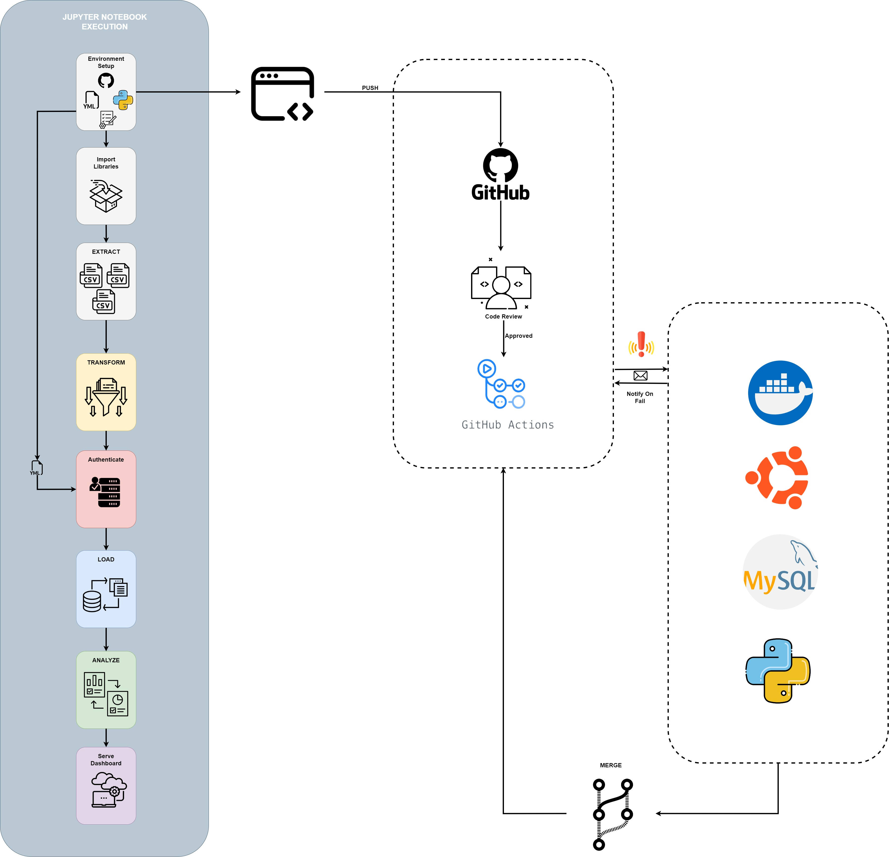
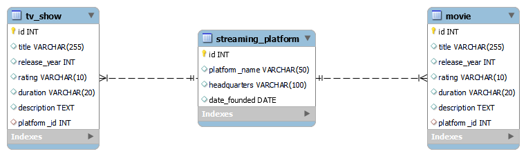

# Streaming_Platforms_SQL

The project focuses on establishing a robust data pipeline for three prominent streaming platforms- Netflix, Amazon Prime, and Disney+. The primary objectives of the project include gaining insights into viewer preferences, analyzing the performance of content across platforms, comparing the platforms, and optimizing operational efficiency. The project aims to facilitate data-driven decision-making for content curation, user experience enhancement, and strategic planning in the highly dynamic streaming industry.

We have three datasets, all of which were found on Kaggle.com. The first one is Netflix movies and TV shows. This dataset contains a little over five thousand movie and tv titles, with fifteen columns such as “Title”, “Description”, “imbd score” (Internet Movie Database Score), and “release year” among others. The dataset is split into two CSV files, one for titles and one for credits. 

The second dataset is the Disney+ movies and TV shows dataset from Kaggle. This has around 1300 titles, with 12 columns containing parameters such as “title”, “director”, “cast”, and “description”, among others. It is a single CSV file.
 
The last dataset is the Amazon Prime movies and TV shows dataset, from Kaggle as well. This contains 1450 unique titles, with 10 columns containing parameters such as “title”, “director”, “cast”, and “country” among others. This dataset contains very similar parameters to the Disney+ dataset. It is a single CSV file.

## Datasets:

https://www.kaggle.com/datasets/shivamb/netflix-shows

https://www.kaggle.com/datasets/shivamb/amazon-prime-movies-and-tv-shows

https://www.kaggle.com/datasets/shivamb/disney-movies-and-tv-shows


## Architectural Overview

The following diagram illustrates the data processing and continuous integration workflow integrating Jupyter notebooks, GitHub Flow with GitHub Actions, a Virtual Environment with Python and MySQL:



### Components and Workflow:

1. **Jupyter Notebook Execution:**
   - `Environment Setup`: Initializing the environment with required settings.
   - `Import Libraries`: Loading necessary libraries for the notebook's operation.
   - `Extract`: Retrieving data from multiple CSV files for processing.
   - `Transform`: Data transformation operations.
   - `Authenticate`: Authentication for secure access.
   - `Load`: Inserting data into a storage system.
   - `Analyze`: Conducting data analysis.
   - `Serve`: Serve the Dashboard on a locally hosted web server.

2. **GitHub Integration:**
   - `Push`: Code or changes being pushed to GitHub.
   - `Code Review`: Reviewing code changes with approval.
   - `GitHub Actions`: Automated workflows triggered by GitHub merge or push event into the main branch.

3. **Notifications and Merging:**
   - `Notify CI`: Notifications are sent to the contributors.
   - `Merge`: Final merging of changes into the main codebase.


The workflow is designed for data processing and analysis projects where Jupyter notebooks are utilized. The GitHub integration facilitates a collaborative and automated CI/CD pipeline, while MySQL serves as the backend database, with Python for scripting and automation tasks.

## Entity-Relationship Diagram (ERD) Overview

The Entity-Relationship Diagram (ERD) below represents the structure of the database associated with our application. It outlines the various tables created after the extraction and transformation of the data. The ERD showcases the relationships between `tv_show`, `streaming_platform`, and `movie` entities:
 



### Key Components of the ERD:

1. **tv_show to streaming_platform:**
   - This is a **many-to-one** relationship.
   - Representation: Dashed line with a crow's foot near `streaming_platform` and a vertical bar near `tv_show`.
   - Implication: Multiple `tv_show` records can be associated with a single `streaming_platform` record. Each TV show is available on one streaming platform, but each platform can host many TV shows.

2. **movie to streaming_platform:**
   - This is also a **many-to-one** relationship.
   - Representation: Dashed line with a crow's foot near `streaming_platform` and a vertical bar near `movie`.
   - Implication: Multiple `movie` records can be associated with a single `streaming_platform` record. Each movie is available on one streaming platform, but each platform can host many movies.

The dashed lines suggest non-identifying relationships, indicating that the `platform_id` foreign key in `tv_show` and `movie` may accept nulls and is not part of their primary keys.

### Summary:

- Both `tv_show` and `movie` entities can have multiple records associated with a single record in the `streaming_platform` entity.
- Each `tv_show` or `movie` is linked to only one `streaming_platform`.

# Setup Instructions
To run this project, follow these steps:

## 1. Clone the repository:
```sh
https://github.com/MatrixSpock/Streaming_Platforms_SQL.git
```
## 2. Navigate to the repository directory:
```sh
cd <repository-name>
```
## 3. Create a virtual environment:
```sh
python -m venv venv
```
```sh
source venv/bin/activate # Unix/MacOS
```
```sh
venv\Scripts\Activate # Windows
```
## 4. Install the required dependencies:
```sh
pip install -r requirements.txt
```
## 5. Database Configuration

Before running the application, you need to set up your database configuration. Follow these steps:

### 5.1 Create a file named `config.yml` in the root directory of the project with the following structure:

```yaml
database_config:
  host: <your_database_host>
  user: <your_database_user>
  password: <your_database_password>
```
### 5.2 Replace <your_database_host>, <your_database_user>, <your_database_password>, and <your_database_name> with your actual database host, username, password, and database name, respectively.
### 5.3 Save the config.yml file
Please do not commit config.yml to your version control system. This file is listed in .gitignore for security reasons.

## 6. Start the Jupyter Lab:
```sh
jupyter lab
```
OR
```sh
jupyter notebook
```
